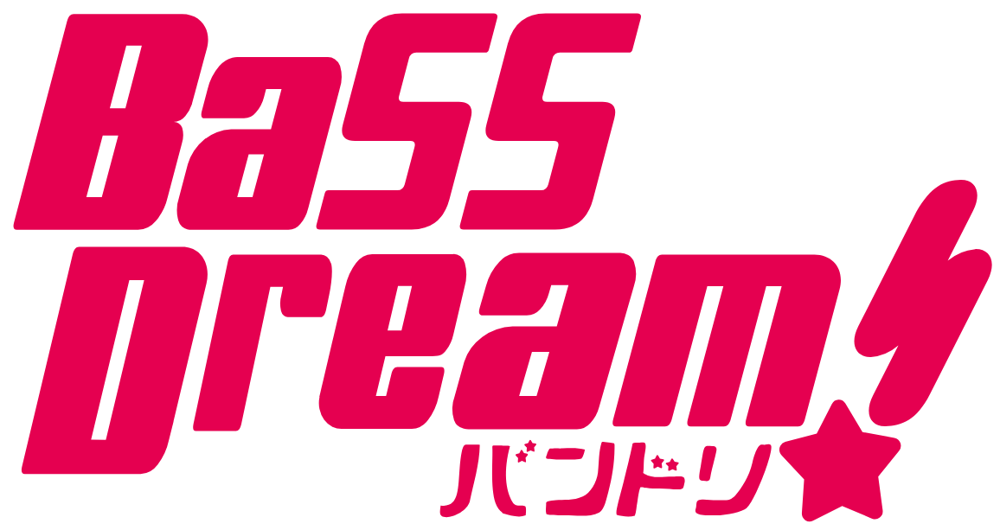

# BaSSDream 🎸

一套专为进阶/专业贝斯乐手量身打造的**全功能本地化智能练琴与扒谱工作站**（BanG Dream! 视觉风格）。



---

## 🌟 核心功能矩阵

1. **本地曲库与乐谱资产管理**
   - 支持 `.gp` / `.gp5` / `.gpx`、伴侣 `.pdf`、高清曲绘、伴奏音频一站式检索与快速分类（5弦专区、古典练习曲、各乐队分类、难度分级等）。
2. **AI 全自动音频扒谱引擎**
   - 音频贝斯轨道分离结合物理声学 CQT + HPS 谐波乘积谱 + Viterbi 全局动态规划解码，自动生成符合 Gould 记谱规范的 Guitar Pro 乐谱工程。
3. **伴奏与乐谱精准时钟对齐**
   - 智能解析 GP 乐谱与音频前导静音/弱起小节，全自动计算并热补丁修正乐谱内嵌音频 `FramePadding`，实现乐谱光标与伴奏毫秒级同步。
4. **Guitar Pro 实时练琴监控与打卡**
   - 后台守护进程监听 Guitar Pro 进程生命周期，自动记录练琴时长、生成练习日历热力图与统计报告。
5. **虚拟指板与人体工程学生理把位分析**
   - 基于弦规与生理代价动态规划算法，分析曲目把位跨度与指法热力分布。
6. **WPF 原生客户端**
   - 基于 .NET 10 WPF，BanG Dream! 风格；内置看谱与播放（伴奏 / 原贝斯 / 谱面合成 / 节拍器，变速、循环、伴奏对齐），改谱交给 Guitar Pro。

---

## 📂 目录架构

```text
BaSSDream/
├── backend/          # Python 后端：扒谱管线、曲库扫描、评测、tab_cli 命令行（WPF 通过它调用）
│   ├── bassnet/      # AI 扒谱模型与特征工程管线
│   ├── bassnet/lab/  # 研究、评测、数据工具脚本（软件不调用）
│   ├── paths.py      # 路径（从项目根目录推算，bassdream.json 可覆盖）
│   ├── schema.py     # data.db 结构的唯一定义
│   └── worker.py     # WPF 调用的常驻 Python 工作进程
├── src-native/       # WPF (.NET 10 C#) 原生客户端工程
├── assets/           # 乐队图标、Logo、字体与视觉资源
├── docs/             # 交接文档（HANDOVER.md）、本机与云端同步、架构方案与排查清单
├── .claude/skills/   # 界面准则 human-made-ui（改界面前先读）、通用设计学 design-craft、设计工作台流程 design-lab
├── .claude/agents/   # design-critic：只看图的设计评审子代理
├── design-lab/       # 设计工作台：小样、参考库、种子与反面清单、字体库清单、setup 脚本
└── bassdream.example.json  # 本机路径配置模板（复制为 bassdream.json）
```

---

## 🚀 快速上手

### 环境要求
- **Python**: 3.11 / 3.14（librosa 等基础库）
- **.NET SDK**: 10.0（构建 WPF 客户端）
- **Guitar Pro**: Guitar Pro 8（用于乐谱同步与交互）

### 构建与运行
```bash
cd src-native && dotnet build -c Release   # 产物复制到项目根目录即部署，运行 BassStation.exe
```

---

## 📌 注意事项
- 本开源仓库仅包含核心系统工程代码、算法实现、WPF 客户端与界面素材。
- 个人的 `.gp` 谱库与音频资产（`tabs/` 目录）以及大型 AI 预训练权重（`cache/` 目录）不随本代码库分发，按需放置在本地相应目录下即可自动识别。
